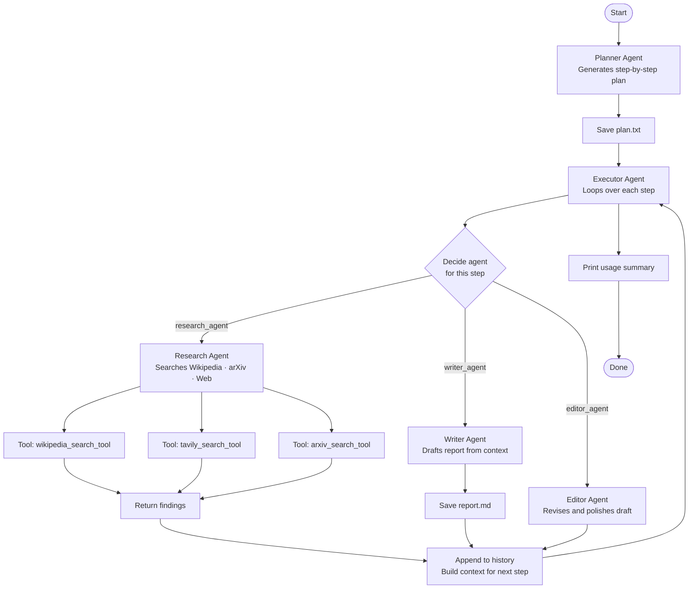

# Research Report Agent with Planning

A multi-agent system that autonomously plans, researches, writes, and edits a research report on any topic — powered by OpenAI and Anthropic models.

---

## File Structure

```
research_report_w_planning_agent/
│
├── main.py          # Agent definitions and entry point
├── config.py        # API keys, model names, and topic config
├── prompts.py       # All prompt templates for each agent
├── tools.py         # Tool definitions and dispatch handler
├── w_utils.py       # Shared utilities: call_model, run_agent_loop, usage tracking
│
├── plan.txt         # Generated at runtime — the planner's step list
├── report.md        # Generated at runtime — the final written report
│
├── .env             # API keys (not committed)
└── .gitignore
```

---

## File Roles

| File | Role |
|---|---|
| `main.py` | Defines all agents and orchestrates the workflow |
| `config.py` | Stores model names, topic, and API key loading |
| `prompts.py` | Prompt templates for planner, researcher, writer, editor, and executor |
| `tools.py` | Tool implementations (Tavily, Wikipedia, arXiv) and the unified `handle_tool_call` dispatcher |
| `w_utils.py` | `call_model` (single-shot), `run_agent_loop` (tool-use loop), `get_usage`, `summarize_usages`, `clean_json_block` |

---

## Agents

| Agent | Role |
|---|---|
| **Planner** | Generates a step-by-step research plan as a Python list |
| **Executor** | Reads each step, decides which agent to call, passes enriched context |
| **Research** | Searches Wikipedia, arXiv, and the web using tool-use loop |
| **Writer** | Drafts the final report from accumulated research context |
| **Editor** | Reflects on the draft and produces a revised, polished version |

---

## Workflow



---

## Setup

1. Clone the repo and install dependencies:
```bash
pip install openai anthropic tavily-python wikipedia python-dotenv pillow
```

2. Create a `.env` file:
```
OPENAI_API_KEY=sk-...
ANTHROPIC_API_KEY=sk-ant-...
OPENWEATHER_API_KEY=...
TAVILY_API_KEY=tvly-...
```

3. Set your topic in `config.py`:
```python
topic = "Java Programming Language"
```

4. Run:
```bash
python main.py
```

---

## Output

| File | Description |
|---|---|
| `plan.txt` | Numbered list of steps the planner generated |
| `report.md` | Final research report in Markdown format |
| Console | Per-step agent output + usage/cost summary table |

---

## Usage Summary Example

```
======================================================================
📊 USAGE SUMMARY
======================================================================
  Step 1 executor                      245 in       52 out  $0.00030
  Step 1 research_agent              1,823 in    1,205 out  $0.00680
  Step 2 executor                      312 in       48 out  $0.00035
  Step 2 research_agent              2,104 in    1,890 out  $0.00950
  Step 3 executor                      298 in       51 out  $0.00032
  Step 3 writer_agent                4,102 in    2,310 out  $0.01240
  Step 4 executor                      310 in       49 out  $0.00034
  Step 4 editor_agent                5,200 in    1,980 out  $0.01450
----------------------------------------------------------------------
  TOTAL                             14,394 in    7,585 out  $0.04421
======================================================================
```
